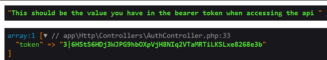

# Contacts API

## Introduction
- Contacts API is a powerful and flexible GraphQL API designed to store, retrieve, update, and delete your contacts.

### Key Functionalities
- Secured API with Google SSO.
- Create, Read, Update, and Delete contacts

### Setup
1. Clone the Repository
2. Run the command `cp .env.example .env`
3. run composer install `composer install`
4. Generate Key `php artisan key:generate`
5. Run the migration and seed`php artisan migrate --seed`
5. Go to `http://localhost:8000`

### Accessing the API
1. Login with a google account in `http://localhost:8000`
2. Your token should be directly printed after successfully logging in

3. Go to your preferred API Platform (I prefer Postman)
4. Add the url `[POST] http://127.0.0.1:8000/graphql`
5. Go to Authorization > Type and choose "bearer token", paste the token you got from logging in


### Viewing all Contacts
`first` - Is a variable that will define how many data you want to show at a time

`id, name, contact_no, created_at, updated_at` - is all the available data from the contact model, remove as needed
```bash
query {
  listContacts(first: 10) {
    data {
      id
      name
      contact_no
      created_at
      updated_at
    }
  }
}
```

Reponse 


```json

{
    "data": {
        "listContacts": {
            "data": [
                {
                    "id": "1",
                    "name": "John Doe",
                    "contact_no": "123456789",
                    "created_at": "2023-12-15 08:27:52",
                    "updated_at": "2023-12-15 08:27:52"
                },
                ...
                {
                    "id": "10",
                    "name": "Jermaine Muller",
                    "contact_no": "334.699.6166",
                    "created_at": "2023-12-15 08:39:02",
                    "updated_at": "2023-12-15 08:39:02"
                }
            ]
        }
    }
}
```


### Viewing a Specific Contact
- Replace 1 with the desired contact ID.

```bash
query {
  viewContact(id: 1) {
    id
    name
    contact_no
    created_at
    updated_at
  }
}

```
Response:
```json
{
    "data": {
        "viewContact": {
            "id": "1",
            "name": "John Doe",
            "contact_no": "123456789",
            "created_at": "2023-12-15 08:27:52",
            "updated_at": "2023-12-15 08:27:52"
        }
    }
}

```
### Creating a New Contact
Modify the values for name and contact_no as needed.
```bash
mutation {
    createContact(name: "New Contact", contact_no: "987654321") {
    id
    name
    contact_no
    created_at
    updated_at
}


```

Response
```json
{
    "data": {
        "createContact": {
            "id": "11",
            "name": "New Contact",
            "contact_no": "987654321",
            "created_at": "2023-12-15 09:00:00",
            "updated_at": "2023-12-15 09:00:00"
        }
    }
}

```

### Updating A Contact
Replace 1 with the contact ID to update.

Modify the values for name and contact_no as needed.

```bash
mutation {
  updateContact(id: 1, name: "Updated Contact", contact_no: "555555555") {
    id
    name
    contact_no
    created_at
    updated_at
  }
}

```
Response
```json
{
    "data": {
        "updateContact": {
            "id": "1",
            "name": "Updated Contact",
            "contact_no": "555555555",
            "created_at": "2023-12-15 08:27:52",
            "updated_at": "2023-12-15 09:15:00"
        }
    }
}

```
### Deleting a Contact

Replace 1 with the contact ID to delete.

```bash
mutation {
  deleteContact(id: 1) {
    id
    name
    contact_no
    created_at
    updated_at
  }
}
```

Response 
```json
{
    "data": {
        "deleteContact": {
            "id": "1",
            "name": "Updated Contact",
            "contact_no": "555555555",
            "created_at": "2023-12-15 08:27:52",
            "updated_at": "2023-12-15 09:15:00"
        }
    }
}

```
